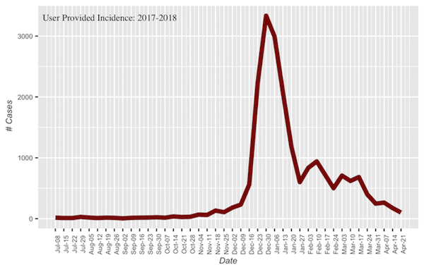
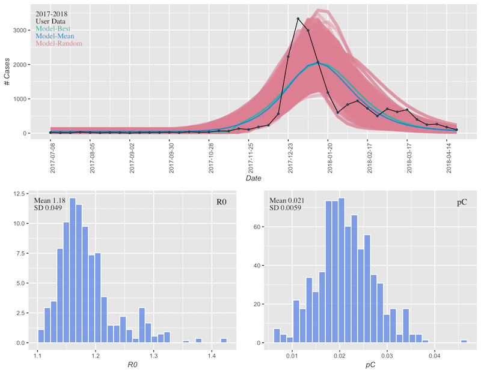
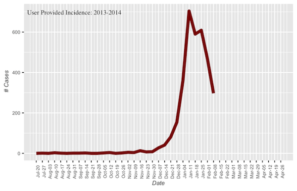
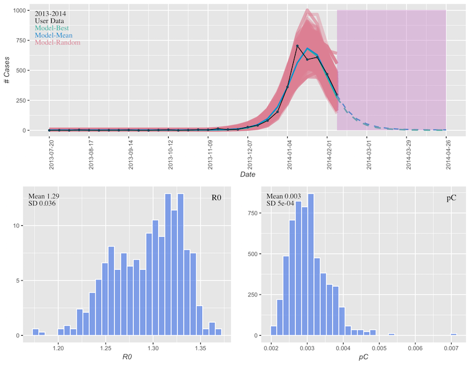
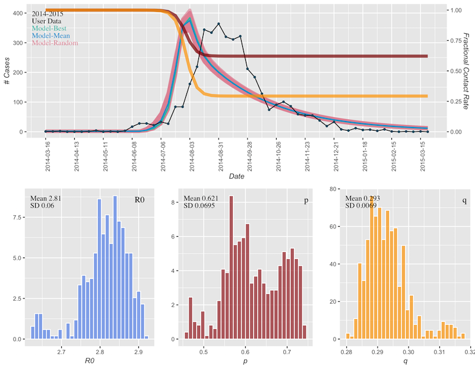
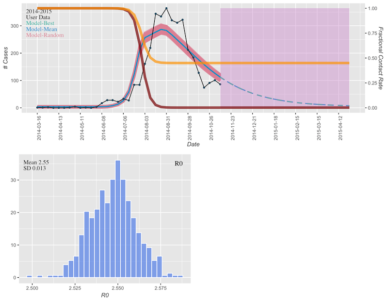
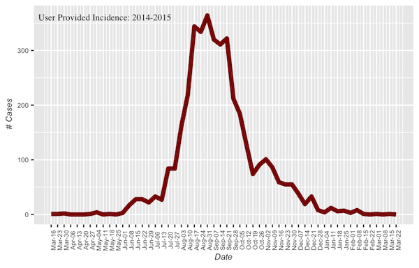
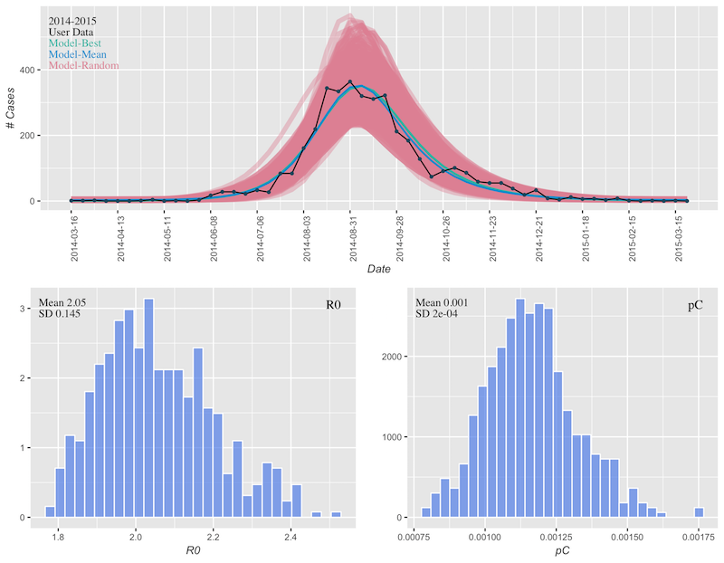

```{r, include = FALSE}
knitr::opts_chunk$set(
  collapse = TRUE,
  comment = "#>"
)
```


This document contains a series of examples using the `runDRAFT()` function.  The objective of these examples is to demonstrate the requied format of input incidence data and show how varying input parameters activates different models and forecasts.

### Example 1
This example fits an SIR model to weekly 2017-2018 San Diego County laboratory-confirmed cases of influenza.  


```{r}
library(DRAFT)
# San Diego 2017-2018 data is included in the package as 
# 'incidence_data1'
head(incidence_data1)

# we will fit data to an SIR model (no behavior terms).
# 1-SIR, 2-SEIR, 3-behavior SIR 
epi_model = 1
# the population is about 3 million
pop = 3e6
# Set disease generation time in days
Tg = 2.6
# latent period in days - needed only for SEIR model 
# (epi_model = 2)
sigma = NULL
# Parameters for behavior modification model only
dp = dq = ts = dL = NULL

```

To run DRAFT, execute the following line in an R console.  It will take a minute or two to execute the MCMC fitting procedure.  The function will create a subdirectory of the current working directory and save the resulting .RData and .png files there.  For more details see the runDRAFT help page `?runDRAFT`.

```{r, eval=F}
results <- runDRAFT(inc_data=incidence_data1, epi_model=epi_model, pop=pop, Tg=Tg, dp=dp, dq=dq, ts=ts, dL=dL)
```
```{r}
# view results in subdirectory
paste0("user_data_", Sys.Date(), "_Tg_", Tg, "/")
```

&nbsp;
&nbsp;
&nbsp;

The first png generated is simply user-provided data.  In this case, that is weekly San Diego County influenza data for the 2017-2018 season.


&nbsp;
&nbsp;
&nbsp;

The second png is a results plot.  Here data is plotted in black, the model best fit (most likely) in green, and the model mean fit in blue.  Additionally, a subset of MCMC profiles are plotted in red.  The resulting red shading helps to visualize the probability density of the MCMC chain.  In the histograms below we see the MCMC chain parameter distributions for basic reproduction number $R_0$ and percent clinical $p_C$.  $p_C$ is defined as the percent of infectious that visit a clinic, but in this case also scales the population to the effective population served by reporting clinics.  For this reason, $p_C$ values may be lower than expected.



<!-- , "_Tg_2.6")`) -->
<!--  -->
&nbsp;
&nbsp;


### Example 2
We now do a fit to the data and then generate a forecast for the following weeks.  The data is similar to example 1, but with 2013-2014 San Diego County laboratory-confirmed cases of influenza.


```{r}
# San Diego 2013-2014 data is included in the package as 
# 'incidence_data2'
head(incidence_data2)

# notice the additional dates at the end of the dataframe with 
# cases=NA.  DRAFT will use the non-NA points to fit a model 
# and then run the model forward to create a forecast for all 
# NA entries.
incidence_data2[28:41, ]

# we will fit data to an SIR model (no behavior terms).
# 1-SIR, 2-SEIR, 3-behavior SIR 
epi_model = 1
# the population is about 3 million
pop = 3e6
# Set disease generation time in days
Tg = 2.6
# latent period in days - needed only for SEIR model, 
# epi_model = 2
sigma = NULL
# Parameters for behavior modification model only
dp = dq = ts = dL = NULL

```

To run DRAFT, execute the following line in an R console.  It will take a minute or two to execute the MCMC fitting procedure.  The function will create a subdirectory of the current working directory and save the resulting .RData and .png files there.  For more details see the runDRAFT help page `?runDRAFT`.

```{r, eval=F}
results <- runDRAFT(inc_data=incidence_data2, epi_model=epi_model, pop=pop, Tg=Tg, dp=dp, dq=dq, ts=ts, dL=dL)
```
```{r}
# view results in subdirectory
paste0("user_data_", Sys.Date(), "_Tg_", Tg, "/")
```


&nbsp;
&nbsp;
&nbsp;



&nbsp;
&nbsp;
&nbsp;

In this example, we have a forecast in addition to model fit.  Purple shading denotes future/forecast weeks and includes the mean and best profile forecasts.



&nbsp;
&nbsp;

### Example 3
This example fits an SIR model with behavior modification to 2014 Ebola data from Liberia.

```{r}
# Liberia 2014 data is included in the DRAFT package 
#as 'incidence_data3'. 
head(incidence_data3)

# No weeks are specified for forecasting
tail(incidence_data3)

# we will fit data to an SIR model with behavior terms.
# 1-SIR, 2-SEIR, 3-behavior SIR 
epi_model = 3
# the population is about 4 million
pop = 4035777
# Set disease generation time in days
Tg = 12
# latent period in days - needed only for SEIR model
sigma = NULL
# Setting the contact rate modifications for Susceptible 
# and Infected to NULL will cause these parameters to be 
# fit.
dp = dq = NULL
# Behavior modifications are known to have commenced at 
# the end of July 2014.
ts = as.Date("2014-07-30")
# It took approximately 20 days for the changes to fully 
# take hold.
dL = 20
```

To run DRAFT, execute the following line in an R console.  It will take a minute or two to execute the MCMC fitting procedure.  The function will create a subdirectory of the current working directory and save the resulting .RData and .png files there.  For more details see the runDRAFT help page `?runDRAFT`.

```{r, eval=F}
results <- runDRAFT(inc_data=incidence_data3, epi_model=epi_model, pop=pop, Tg=Tg, dp=dp, dq=dq, ts=ts, dL=dL)
```
```{r}
# view results in subdirectory
paste0("user_data_", Sys.Date(), "_Tg_", Tg, "/")
```


&nbsp;
&nbsp;
&nbsp;


&nbsp;
&nbsp;
&nbsp;

In this example we specified when behavior changes were initiated and how long they took to take full effect.  Then the model fit the effectiveness of the behavior changes.  This plot shows the data (black) and resulting fit (blue, green, magenta) as well as fractional contact rates for Infectious (yellow/orange) and Suseptibles (red).  In the histograms below we see the MCMC chain parameter distributions for basic reproduction number $R_0$, Susceptible fractional contact rate $p$, and Infectious fractional contact rate $q$.



&nbsp;
&nbsp;

### Example 4
This example fits an SIR model with behavior modifications to 2014 Ebola data from Liberia and forecasts the following weeks.


```{r}
# Liberia 2014 data is included in the DRAFT package 
# as 'incidence_data4'. 
head(incidence_data4)

# Several weeks have been marked for 
# forecasting (cases=NA)
incidence_data4[34:40, ]

# we will fit data to an SIR model with behavior 
# terms. # 1-SIR, 2-SEIR, 3-behavior SIR 
epi_model = 3
# the population is about 4 million
pop = 4035777
# Set disease generation time in days
Tg = 12
# latent period in days - needed only for SEIR model, 
#epi_model = 2
sigma = NULL
# When forecast periods are requested the contact rate 
# modifications for Susceptible and Infected must be set 
# by the user. These values indicate that the initial 
# contact rate for susceptibles will be multiplied by a 
# factor of 1-dp and the initial contact rate of infectious 
# is multiplied by a factor of 1-dq.
dp = 0.002
dq = 0.45
# Behavior modifications are known to have commenced at 
# the end of July 2014.
ts = as.Date("2014-07-30")
# It took approximately 20 days for the changes to fully take hold.
dL = 20
```

To run DRAFT, execute the following line in an R console.  It will take a minute or two to execute the MCMC fitting procedure.  The function will create a subdirectory of the current working directory and save the resulting .RData and .png files there.  For more details see the runDRAFT help page `?runDRAFT`.

```{r, eval=F}
results <- runDRAFT(inc_data=incidence_data4, epi_model=epi_model, pop=pop, Tg=Tg, dp=dp, dq=dq, ts=ts, dL=dL)
```
```{r}
# view results in subdirectory
paste0("user_data_", Sys.Date(), "_Tg_", Tg, "/")
```


&nbsp;
&nbsp;
&nbsp;


&nbsp;
&nbsp;
&nbsp;

In this example we specified all behavior change parameters and requested a forecast of future weeks.  This plot shows the data (black), resulting fit (blue, green, magenta), forecast (purple shading), fractional contact rates for Infectious (yellow/orange), and fractional contact rates for Suseptibles (red).  In the histograms below we see the MCMC chain parameter distributions for basic reproduction number $R_0$, suggesting that $R_0$ was quite high (approx 2.5) prior to the behavior modifications.



&nbsp;
&nbsp;

### Example 5
This example is similar to example 3 except it fits an SEIR model to 2014 Ebola data from Liberia.


```{r}
# Liberia 2014 data is included in the DRAFT package 
# as 'incidence_data4'. 
head(incidence_data3)

# we will fit data to an SIR model with behavior terms.
# 1-SIR, 2-SEIR, 3-behavior SIR 
epi_model = 2
# the population is about 4 million
pop = 4035777
# Set disease generation time in days
Tg = 17
# latent period in days - needed only for SEIR 
# model, epi_model = 2
sigma = 5
# Parameters for behavior modification model only
dp = dq = ts = dL = NULL
```

To run DRAFT, execute the following line in an R console.  It will take a minute or two to execute the MCMC fitting procedure.  The function will create a subdirectory of the current working directory and save the resulting .RData and .png files there.  For more details see the runDRAFT help page `?runDRAFT`.

```{r, eval=F}
results <- runDRAFT(inc_data=incidence_data3, epi_model=epi_model, pop=pop, Tg=Tg, dp=dp, dq=dq, ts=ts, dL=dL)
```

```{r}
# view results in subdirectory
paste0("user_data_", Sys.Date(), "_Tg_", Tg, "/")
```

&nbsp;
&nbsp;
&nbsp;



&nbsp;
&nbsp;
&nbsp;

This example fits 2014 ebola data using an SEIR model.  The resulting fit and parameter distributions are illustrated below.



&nbsp;
\
